# [TIC TAC TOE](https://riiyu7.github.io/Tic-Tac-Toe)

Welcome to 'Love Tic Tac Toe'. Love Tic Tac Toe  is an interactive web-based game of the classic strategy of tic-tac-toe, a fun free game for all ages for times where you need to sit back, relax, and play.


## UX


### Colour Scheme

I have used [coolors.co](https://coolors.co/8052ec-d161ff-333333-f2f2f2-dddddd) to display and create my colour palette.


- `#8052ec` used for background gradient one.
- `#d161ff` used for background gradient one and as the scoreboard buttons.
- `#333333` used for text shadows and background effects.
- `#f2f2f2` used for primary texts.
- `#DDDDDD` used for top-navifation hover.


### Typography

For Love Tic Tac Toe, I used Google Font 'Raleway' as my primary font, with sans-serif being my secondary text.

- [Raleway](https://fonts.google.com/specimen/Raleway) was used for the primary headers and titles.

- [Sans-serif] was used as my secondary text should my primary font not load.

- [Font Awesome](https://fontawesome.com) icons were used throughout the site, such as the social media icons in the footer.

### CSS Implementation

Raleway font is included at the beginning of my CSS file using the '@import' method from Google Fonts. This ensures that Raleway is loaded as soon as CSS is loaded.

```css
/* Importing Google Fonts */
@import url('https://fonts.googleapis.com/css2?family=Raleway:wght@400;600&display=swap');
```

## User Stories

### New Site Users

My targets for users visiting Love Tic Tac Toe include:

- Providing a fun and relaxed game that could be played with friends or family.
- Providing a clean yet visually appealing website for users.
- Accessibility so users can play Love Tic Tac Toe across different devices. 
- Ease of use, creating a website that is easy to navigate, and a game that is easy to play.

### Returning Site Users

My targets for returning users include:

- Collecting user feedback to continuously improve the game and website.
- Provide a multiplayer function that allows users to play with each other from different locations.
- Include a leaderboard system that provides a competitive factor to the game.
- Include a reward system which rewards players for continuous plays and wins.

### Expectations

When users visit Love Tic Tac Toe, they can expect:

- A visually appealing design throughtout the website and the game.
- Continuous website and game updates, changing styles of the board to keep the look of the game visually appealing, and ensuring the look doesn't get dull for users.

## Wireframes

I've used [Balsamiq](https://balsamiq.com/wireframes) to design my site's wireframes.

### Mobile Wireframes

<details>
<summary> Click here to see the Mobile Wireframes </summary>

| Page    | Screenshots                                                | Notes             |
| ------- | ---------------------------------------------------------- | ------------------|
|Index    | 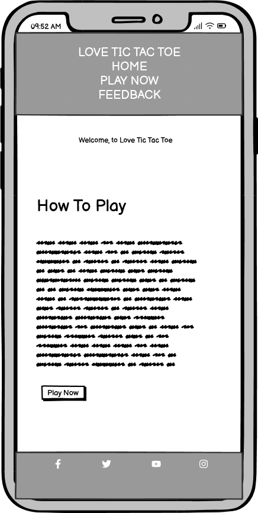    | Home/Index page   |
|Play Now | 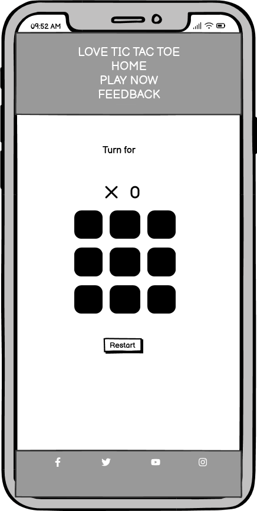     | Tic Tac Toe board |
|Feedback | 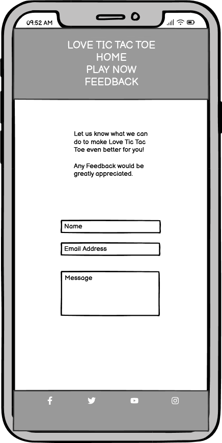 | Feecback form     |
|Thank You| 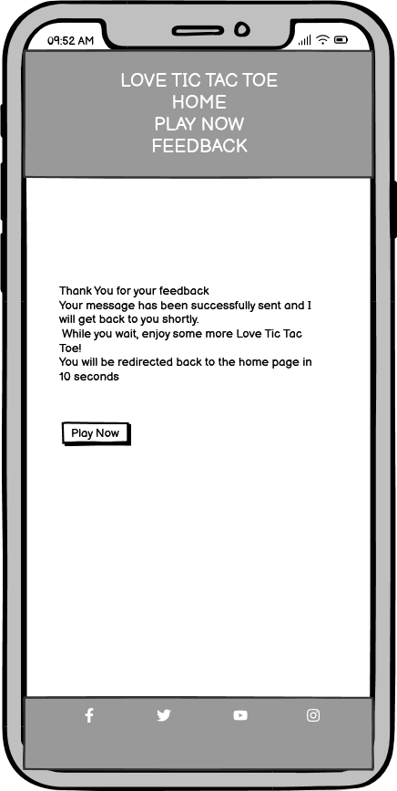 | Thank you message |

</details>

### Tablet Wireframes

<details>
<summary> Click here to see the Tablet Wireframes </summary>

| Page    | Screenshots                                                | Notes             |
| ------- | ---------------------------------------------------------- | ------------------|
|Index    | 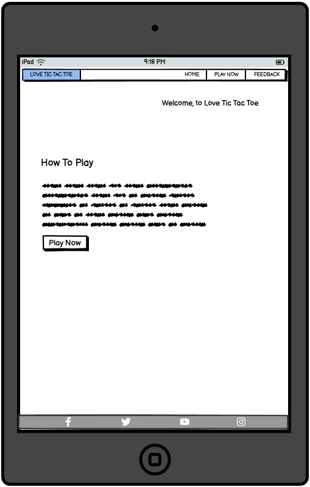    | Home/Index page   |
|Play Now | 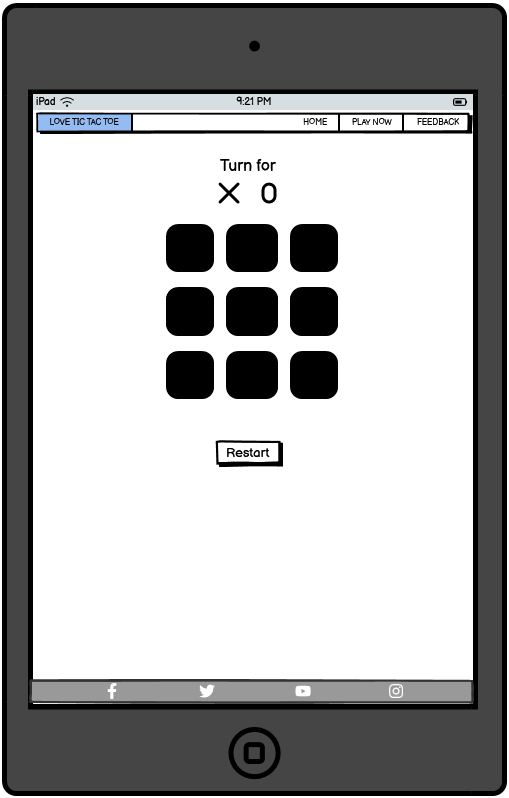  | Tic Tac Toe board |
|Feedback | 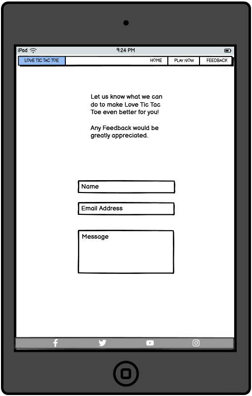 | Feecback form     |
|Thank You| 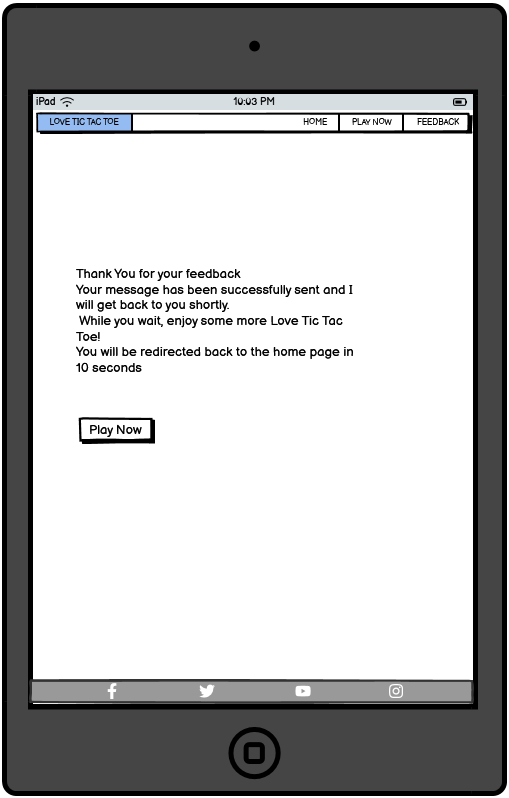 | Thank you message |

</details>

### Desktop Wireframes

<details>
<summary> Click here to see the Desktop Wireframes </summary>

| Page    | Screenshots                                                   | Notes             |
| ------- | ----------------------------------------------------------    | ------------------|
|Index    | 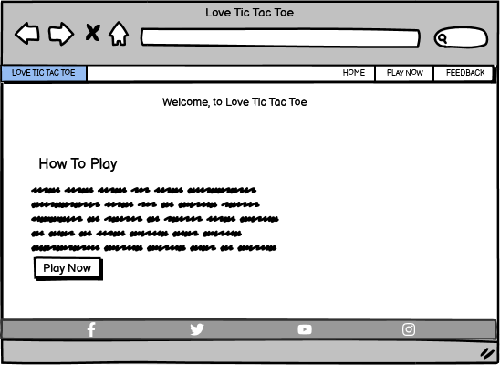      | Home/Index page   |
|Play Now |     | Tic Tac Toe board |
|Feedback | 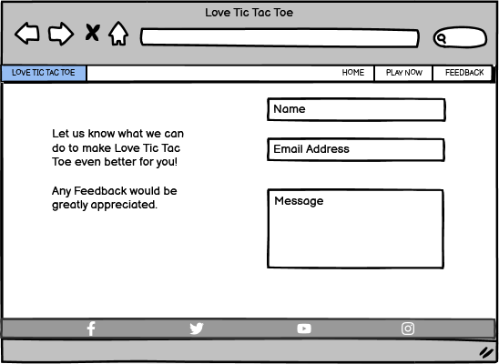   | Feecback form     |
|Thank You| 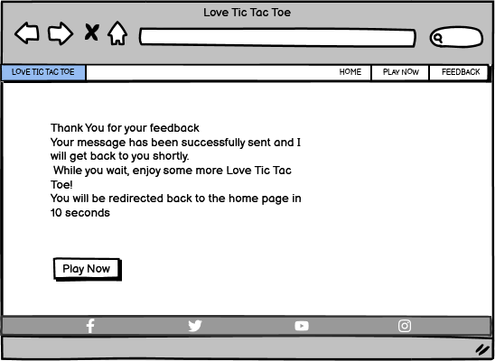 | Thank you message |

</details>

## Features


### Existing Features

- Scoreboard Hover

    - I have added a hover feature over the board that displays a purple box on the square that is selected. This is done so players are aware of what position they have the cursor in.


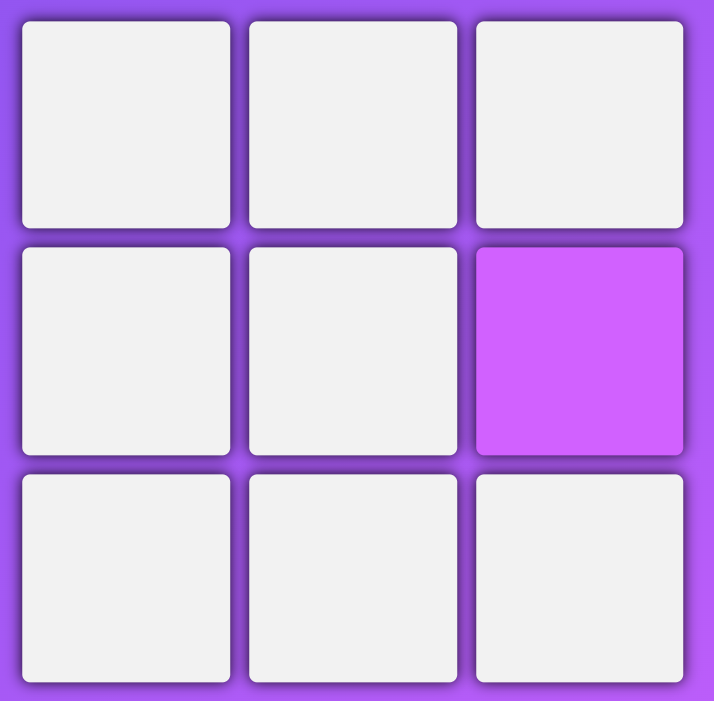

- Turn Counter

    - A Turn counter is added to provide an easy visual representation of which player's turn it is.


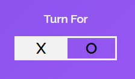

- Feedback Form

    - A feedback form has been included within my website, so I am able to collect user data and enhance it regularly.


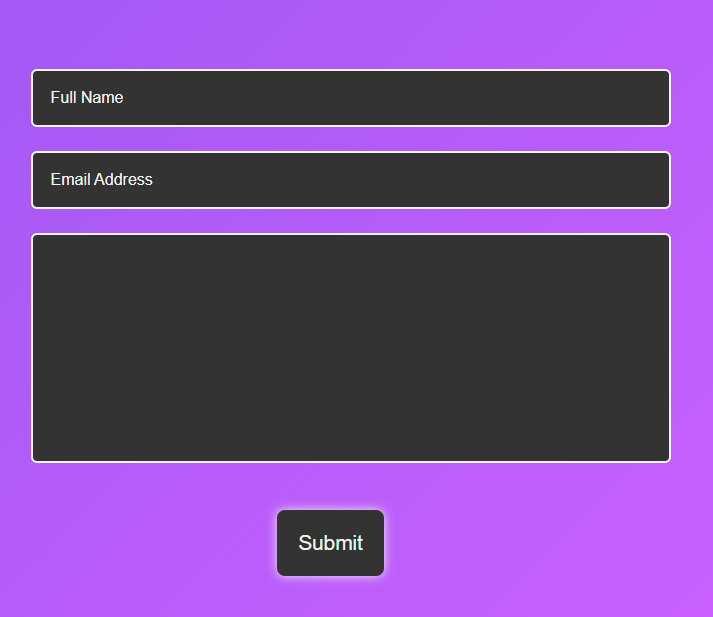


### Future Features

- Leaderboard
    - Introduce a leaderboard within the game mechanics that shows the players with the most wins.

- Multiplayer feature
    - Introduce a multiplayer function where players can challenge others within the leaderboard or friends from different locations.

- Vs Ai
    - Add a AI player where players can compete and train their logical skills against an AI.

- Tic Tac Tournament
    - Add weekly, monthly, and yearly tournaments where all players can compete for prizes.

- Tic Tac XL
    - Implement new Tic Tac Toe boards that include bigger grids and 2 v 2 modes.

- Reward system
    - Introduce a reward system where top players get rewarded for obtaining wins or winning tournaments.

## Tools & Technologies Used

- [HTML](https://en.wikipedia.org/wiki/HTML) used for the main site content.
- [CSS](https://en.wikipedia.org/wiki/CSS) used for the main site design and layout.
- [CSS Flexbox](https://www.w3schools.com/css/css3_flexbox.asp) used for an enhanced responsive layout.
- [CSS Grid](https://www.w3schools.com/css/css_grid.asp) used for an enhanced responsive layout.
- [JavaScript](https://www.javascript.com) used for user interaction on the site.
- [Git](https://git-scm.com) used for version control. (`git add`, `git commit`, `git push`)
- [GitHub](https://github.com) used for secure online code storage.
- [GitHub Pages](https://pages.github.com) used for hosting the deployed front-end site.
- [Gitpod](https://gitpod.io) used as a cloud-based IDE for development.

## Testing

For all testing, please refer to the [TESTING.md](TESTING.md) file.

## Deployment

The site was deployed to GitHub Pages. The steps to deploy are as follows:

- In the [GitHub repository](https://github.com/riiyu7/Tic-Tac-Toe), navigate to the Settings tab 
- From the source section drop-down menu, select the **Main** Branch, then click "Save".
- The page will be automatically refreshed with a detailed ribbon display to indicate the successful deployment.

The live link can be found [here](https://riiyu7.github.io/Tic-Tac-Toe)

### Local Deployment

This project can be cloned or forked in order to make a local copy on your own system.

#### Cloning

You can clone the repository by following these steps:

1. Go to the [GitHub repository](https://github.com/riiyu7/Tic-Tac-Toe) 
2. Locate the Code button above the list of files and click it 
3. Select if you prefer to clone using HTTPS, SSH, or GitHub CLI and click the copy button to copy the URL to your clipboard
4. Open Git Bash or Terminal
5. Change the current working directory to the one where you want the cloned directory
6. In your IDE Terminal, type the following command to clone my repository:
	- `git clone https://github.com/riiyu7/Tic-Tac-Toe.git`
7. Press Enter to create your local clone.

Alternatively, if using Gitpod, you can click below to create your own workspace using this repository.

[](https://gitpod.io/#https://github.com/riiyu7/Tic-Tac-Toe)

Please note that in order to directly open the project in Gitpod, you need to have the browser extension installed.
A tutorial on how to do that can be found [here](https://www.gitpod.io/docs/configure/user-settings/browser-extension).

#### Forking

By forking the GitHub Repository, we make a copy of the original repository on our GitHub account to view and/or make changes without affecting the original owner's repository.
You can fork this repository by using the following steps:

1. Log in to GitHub and locate the [GitHub Repository](https://github.com/riiyu7/Tic-Tac-Toe)
2. At the top of the Repository (not top of page) just above the "Settings" Button on the menu, locate the "Fork" Button.
3. Once clicked, you should now have a copy of the original repository in your own GitHub account!

### Local VS Deployment

Throughout the project and the development of 'Love Tic Tac Toe,' I ensured a responsive and consistant environment between local and live deployment. 

## Credits

The information I obtained from a range of sources assisted me in the completion of the project, and I am very grateful for the resources and assitance I received.

### Content
| Source                                                                                                           | Location                         | Notes                                                                  |
| ---------------------------------------------------------------------------------------------------------------- | -------------------------------- | -----------------------------------------------------------------------|
| [Markdown Builder](https://tim.2bn.dev/markdown-builder)                                                         | README and TESTING               | Tool to help generate the Markdown files                               |
| [Code Institute](https://learn.codeinstitute.net/ci_program/diplomainfullstacksoftwarecommoncurriculum)          | Entire site                      | Help with creating my website via modules and example projects         |
| [Favicon](https://favicon.io/)                                                                                   | Entire site                      | Tool to change logo image to a favicon                                 |
| [Flaticon](https://www.flaticon.com/free-icons/tic-tac-toe)                                                      | Entire site                      | Logo for favicon created by Freepik                                    |
| [Chris Beams](https://chris.beams.io/posts/git-commit)                                                           | version control                  | "How to Write a Git Commit Message"                                    |
| [W3Schools](https://www.w3schools.com/howto/howto_js_topnav_responsive.asp)                                      | Entire site                      | Responsive HTML/CSS/JS navbar                                          |
| [W3Schools](https://www.w3schools.com/howto/howto_css_modals.asp)                                                | Contact page                     | Interactive pop-up (modal)                                             |
| [W3schools](https://www.w3schools.com/howto/howto_css_topnav_centered.asp)                                       | How TO - Centered Top Navigation | Tutorial on creating Top navigation bar                                |
| [W3Schools](https://www.w3schools.com/howto/howto_css_fixed_footer.asp)                                          | How To Create a Fixed Footer     | Tutorial on creating fixed footer                                      |                             
| [Flexbox Froggy](https://flexboxfroggy.com/)                                                                     | Entire site                      | Modern responsive layouts                                              |
| [Grid Garden](https://cssgridgarden.com)                                                                         | Entire site                      | Modern responsive layouts                                              |
| [YouTube](https://www.youtube.com/watch?v=al_AgC2NSCo&themeRefresh=1)                                            | Tic Tac Toe Board                | Tutorial on creating a Tic Tac Toe Board                               |
| [Codingartistweb](https://codingartistweb.com/2022/01/tic-tac-toe-game-html-css-and-javascript/#google_vignette) | Tic Tac Toe Board                | Tutorial on creating a Tic Tac Toe Board                               |
| [Youtube](https://www.youtube.com/watch?v=n6gzxTsbHLc)                                                           | Turn Counter                     | Tutorial on creating a turn counter                                    |
| [Youtube](https://www.youtube.com/watch?v=10Z6UIe7R1E)                                                           | Website style                    | Assitance with creating general style of the website                   |
| [Exploratorium](https://www.exploratorium.edu)                                                                   | Tic Tac Toe Rules                | Obtain rules for Tic Tac Toe rulkes                                    |
| [Rheymart Macon-ay](https://www2.codementor.io/@leadmentor9)                                                     | Assitance with turn counter      | Provided mentoring with scoreboard to ensure code is working correctly |
| [Yasir Iqbal](https://www.codementor.io/@yasiriqbal)                                                             | Assitance with media screen      | Provided mentoring with media screens                                  |
| [Youtube](https://www.youtube.com/watch?v=IxziwuuaS3c)                                                           | Feedback form                    | Tutorial on creating a Form                                            |
| [Johnny Trinh](https://github.com/JohnnySonTrinh)                                                                | Inspiration                      | Gained insipiration from seeing well created projects                  |
  
### Media

I obtained my social media icons from [Font Awesome](https://fontawesome.com):

- [Facebook](https://fontawesome.com/icons/facebook?f=brands&s=solid)
- [Instagram](https://fontawesome.com/icons/instagram?f=brands&s=solid)
- [Twitter](https://fontawesome.com/icons/twitter?f=brands&s=solid)
- [Youtube](https://fontawesome.com/icons/square-youtube?f=brands&s=solid)

I also used [Flaticon](https://www.flaticon.com/) to obtain my logo, which I then used [Favicon](https://favicon.io/) to create favicons of various sizes.

### Acknowledgements

- I would like to thank my Code Institute mentor, [Tim Nelson](https://github.com/TravelTimN) for their support throughout the development of this project.
- I would like to thank the [Code Institute Slack community](https://code-institute-room.slack.com) for the moral support; it kept me going during periods of self doubt and imposter syndrome.
