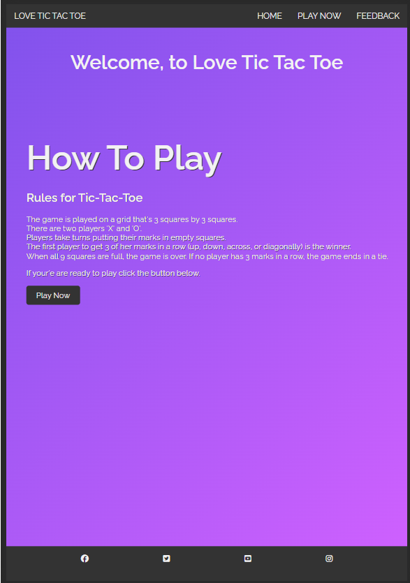
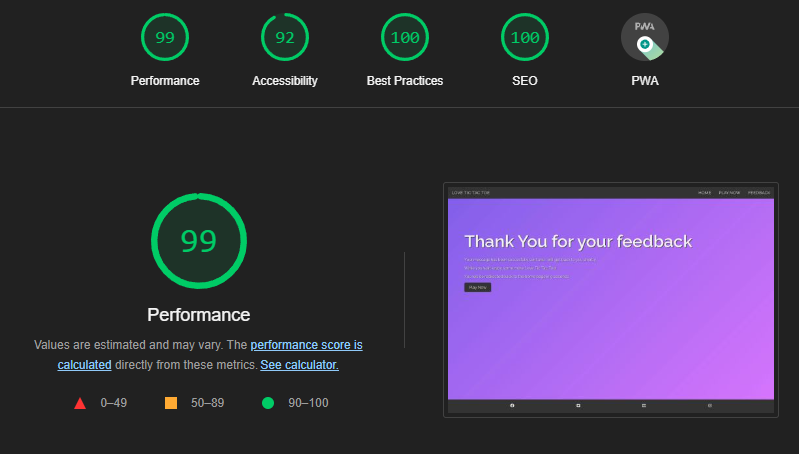
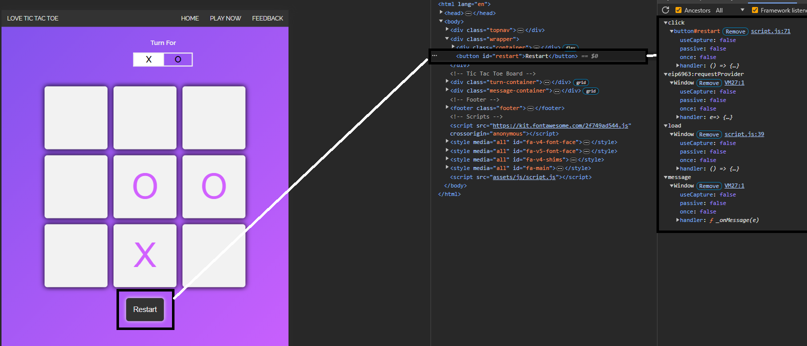

# Testing

Welcome to TESTING.md. I will discuss in this file the testing I have completed to ensure that all elements are tested and are responsive across different devices.

Return back to the [README.md](README.md) file.

## Code Validation

### HTML

I have used the recommended [HTML W3C Validator](https://validator.w3.org) to validate all of my HTML files.

| Page      | W3C URL                                                                                                   | Screenshot                                                       | Notes           |
| ---       | ---                                                                                                       | ---                                                              | ---             |
| Home      | [W3C](https://validator.w3.org/nu/?doc=https%3A%2F%2Friiyu7.github.io%2FTic-Tac-Toe%2Findex.html)         |     | Pass: No Errors |
| Play Now  | [W3C](https://validator.w3.org/nu/?doc=https%3A%2F%2Friiyu7.github.io%2FTic-Tac-Toe%2Fplay.html)          |      | Pass: No Errors |
| Feedback  | [W3C](https://validator.w3.org/nu/?doc=https%3A%2F%2Friiyu7.github.io%2FTic-Tac-Toe%2Ffeedback.html)      |  | Pass: No Errors |
| Thank You | [W3c](https://validator.w3.org/nu/?doc=https%3A%2F%2Friiyu7.github.io%2FTic-Tac-Toe%2Fthankyou.html%3F)   |  | Pass: No Errors |

### CSS

I have used the recommended [CSS Jigsaw Validator](https://jigsaw.w3.org/css-validator) to validate all of my CSS files.

| File      | Jigsaw URL                                                                                               | Screenshot                                             | Notes           |
| ---       | ---                                                                                                      | ---                                                    | ---             |
| style.css | [Jigsaw](https://jigsaw.w3.org/css-validator/validator?uri=https%3A%2F%2Friiyu7.github.io%2FTic-Tac-Toe) |  | Pass: No Errors |

### JavaScript

I have used the recommended [JShint Validator](https://jshint.com) to validate all of my JS files.

| File      | Screenshot                                                   | Notes           |
| ---       | ---                                                          | ---             |
| script.js |  | Pass: No Errors |

## Browser Compatibility

I have used different browsers to check any browser compatibility issues.

The browsers that I used were:

- [Chrome](https://www.google.com/)
- [Edge](https://www.microsoft.com/edge)
- [Brave](https://brave.com/download)

I've tested my deployed project on multiple browsers to check for compatibility issues.

| Browser | Home                                                    | Play                                                   | Feedback                                                   | Thank You                                                  | Notes             |
| ---     | ---                                                     | ---                                                    | ---                                                        | ---                                                        | ---               |
| Chrome  |  |  |  |  | Works as expected |
| Edge    |    |    |    |    | Works as expected |
| Brave   |   |   |  |   | Works as expected |

## Responsiveness

I've tested my deployed project on multiple devices to check for responsiveness issues.

| Device            | Home                                             | Play                                            | Feedback                                             | Thank You                                            | Notes                |
| ---               | ---                                              | ---                                             | ---                                                  | ---                                                  | ---                  |
| Mobile (DevTools) |  |  |   |   | Works as expected    |
| Tablet (DevTools) |  |  |   |   | Works as expected    |
| Desktop           |    |    |     |     | Works as expected    |
| Samsung s23 Ultra |     |     |      |      | Works as expected    |

## Lighthouse Audit

I've tested my deployed project using the Lighthouse Audit tool to check for any major issues.

| Page      | Mobile                                                             | Desktop                                                             | Notes                |
| ---       | ---                                                                | ---                                                                 | ---                  | 
| Home      |      |      | Some minor warnings  |
| Play      |       |       | Some minor warnings  |
| Feedback  |   |   | Some minor warnings  |
| Thank you |   |   | Some minor warnings  |

## Defensive Programming

Defensive programming was manually tested with the below user acceptance testing:

| Page   | Expectation | Test | Result | Fix | Screenshot |
| ---    | --- | --- | --- | --- | --- |
| Home   | | | | | |
|        | Love Tic Tac Toe Header is expected to redirect to index.html when the user clicks on heading. | Tested the feature by clicking 'Love Tic Tac Toe' in the header. | The feature behaved as expected, and it redirects to index.html. | Test concluded and passed. |  |
|        | Play Now feature is expected to redirect to play.html when the user clicks the button. | Tested the feature by clicking the 'Play Now' button. | The feature behaved as expected, and it redirects to play.html. | Test concluded and passed |  |
| Play   | | | | | |
|        | Restart button is expected to restart the board when clicked. | Tested the feature by clicking 'Restart'. | The feature behaved as expected, and it restarted the board. | Test concluded and passed. |  |
|        | Turn Counter is expected to change after every turn when the user clicks a box on the grid. | Tested the feature by clicking the grid, and the turn counter changed accordingly. | The feature behaved as expected, and it restarted the board. | Test concluded and passed. |  |
| Feedback | | | | | |
|        | Name field is expected to show error message when left empty. | Tested the feature by leaving field blank and clicking 'Submit'. | The feature behaved as expected, and displayed a error message. | Test concluded and passed. |  |
|        | Email Name field is expected to show error message when left empty. | Tested the feature by leaving field blank and clicking submit.  | The feature behaved as expected, and displayed an error message. | Test concluded and passed. |  |
|        | Submit button redirects to thankyou.html. | Tested the feature by adding information to fields and clicking submit. | The feature behaved as expected, and it redirects to thankyou.html  | Test concluded and passed. |  |
| Thank You | | | | | |
|        | Countdown timer countsdown to 10 before redirecting user to index.html. | Tested the feature by waiting 10 seconds. | The feature behaved as expected, and it redirected to index.html. | Test concluded and passed. |  |
|        | Play Now feature is expected to redirect to play.html when the user clicks the button. | Tested the feature by clicking 'Play Now' button. | The feature behaved as expected, and it redirects to play.html. | Test concluded and passed.  |  |
| All Pages | Responsive Nav bar should redirect users to relevant paes | Tested the feature by clicking through all pages on all HTML pages | The feature behaved as expected, and it redirects to relevant pages | Test concluded and passed.  |  |
|           | social media icons should redirect users to relevant social media links | Tested the feature by clicking through all social media icons and reviewing code to ensure it opens in a new tab | The feature didin't open a new tab when clicked  | Fixed issue by adding target="_blank" to anchor link, and when clicked, a new tab opens. |  |

## Bugs

- JS Uncaught TypeError: Cannot read properties of null script.js:71 (reading 'addEventListener').

    

    - To fix this, I removed line 94 from my feedback.html page, as I had no JS within that page, it caused the above bug.

- Redirect Timer on thankyou.html went below 10 seconds and would not redirect.

    

    - To fix this, I added a meta tag ' http-equiv="refresh" content="10;url=index.html ' on line 6, which resolved the issue.

## Unfixed Bugs

I started the project using the desktop view, and towards the end of the project, I added media queries, which resulted in inconsistent CSS on my play.HTML page, the following bugs were found:

- Bug with Turn counter position

    

    - Attempted fix: I tried to add additional media queries to handle the position of the turn counter, but as I changed the CSS, the position kept varying with different devices.

    - Bug with Win message position

    

    - Attempted fix: I tried to add additional media queries to handle the position of the message, and I experienced a similar problem as above.

    - Future resolution: I will attempt to create the same game but using root variables as well, creating the website from lower dimensions to higher dimensions to ensure the elements like this are consistent across all devices.

