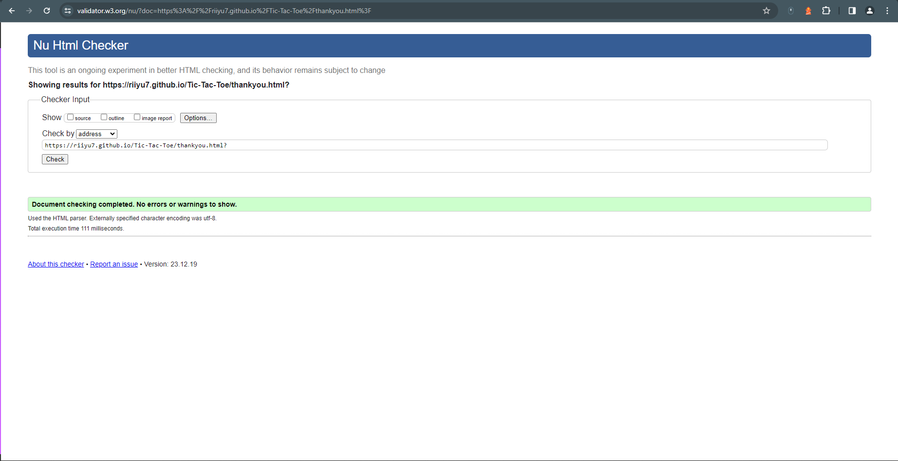

# Testing

Welcome, in this file I will discuss in this file the testing I have completed to ensure that all elements are tested and are responsive across diffrent devices.

Return back to the [README.md](README.md) file.

## Code Validation

### HTML

I have used the recommended [HTML W3C Validator](https://validator.w3.org) to validate all of my HTML files.

| Page      | W3C URL                                                                                                   | Screenshot                                                       | Notes           |
| ---       | ---                                                                                                       | ---                                                              | ---             |
| Home      | [W3C](https://validator.w3.org/nu/?doc=https%3A%2F%2Friiyu7.github.io%2FTic-Tac-Toe%2Findex.html)         |     | Pass: No Errors |
| Play Now  | [W3C](https://validator.w3.org/nu/?doc=https%3A%2F%2Friiyu7.github.io%2FTic-Tac-Toe%2Fplay.html)          |      | Pass: No Errors |
| Feedback  | [W3C](https://validator.w3.org/nu/?doc=https%3A%2F%2Friiyu7.github.io%2FTic-Tac-Toe%2Ffeedback.html)      |  | Pass: No Errors |
| Thank You | [W3c](https://validator.w3.org/nu/?doc=https%3A%2F%2Friiyu7.github.io%2FTic-Tac-Toe%2Fthankyou.html%3F)   |  | Pass: No Errors |

### CSS

I have used the recommended [CSS Jigsaw Validator](https://jigsaw.w3.org/css-validator) to validate all of my CSS files.

| File      | Jigsaw URL                                                                                               | Screenshot                                             | Notes           |
| ---       | ---                                                                                                      | ---                                                    | ---             |
| style.css | [Jigsaw](https://jigsaw.w3.org/css-validator/validator?uri=https%3A%2F%2Friiyu7.github.io%2FTic-Tac-Toe) |  | Pass: No Errors |

### JavaScript

I have used the recommended [JShint Validator](https://jshint.com) to validate all of my JS files.

| File      | Screenshot                                                   | Notes           |
| ---       | ---                                                          | ---             |
| script.js |  | Pass: No Errors |

## Browser Compatibility

I have used different browsers to check any browser compatibility issues.

The browsers which I used were:

- [Chrome](https://www.google.com/)
- [Edge](https://www.microsoft.com/edge)
- [Brave](https://brave.com/download)

I've tested my deployed project on multiple browsers to check for compatibility issues.

| Browser | Home                                                    | Play                                                   | Feedback                                                   | Thank You                                                  | Notes             |
| ---     | ---                                                     | ---                                                    | ---                                                        | ---                                                        | ---               |
| Chrome  |  |  |  |  | Works as expected |
| Edge    |    |    |    |    | Works as expected |
| Brave   |   |   |  |   | Works as expected |

## Responsiveness

I've tested my deployed project on multiple devices to check for responsiveness issues.

| Device            | Home                                             | Play                                            | Feedback                                             | Thank You                                            | Notes                |
| ---               | ---                                              | ---                                             | ---                                                  | ---                                                  | ---                  |
| Mobile (DevTools) |  |  |   |   | Works as expected    |
| Tablet (DevTools) |  |  |   |   | Works as expected    |
| Desktop           |    |    |     |     | Works as expected    |
| Samsung s23 Ultra |     |     |      |      | Works as expected    |

## Lighthouse Audit

I've tested my deployed project using the Lighthouse Audit tool to check for any major issues.

| Page      | Mobile                                                             | Desktop                                                             | Notes                |
| ---       | ---                                                                | ---                                                                 | ---                  | 
| Home      |      |      | Some minor warnings  |
| Play      |       |       | Some minor warnings  |
| Feedback  |   |   | Some minor warnings  |
| Thank you |   |   | Some minor warnings  |

## Defensive Programming

🛑🛑🛑🛑🛑 START OF NOTES (to be deleted) 🛑🛑🛑🛑🛑

Defensive programming (defensive design) is extremely important!

When building projects that accept user inputs or forms, you should always test the level of security for each.
Examples of this could include (not limited to):

Forms:
- Users cannot submit an empty form
- Users must enter valid email addresses

You'll want to test all functionality on your application, whether it's a standard form,
or uses CRUD functionality for data manipulation on a database.
Make sure to include the `required` attribute on any form-fields that should be mandatory.
Try to access various pages on your site as different user types (User-A, User-B, guest user, admin, superuser).

You should include any manual tests performed, and the expected results/outcome.

Testing should be replicable.
Ideally, tests cases should focus on each individual section of every page on the website.
Each test case should be specific, objective, and step-wise replicable.

Instead of adding a general overview saying that everything works fine,
consider documenting tests on each element of the page
(ie. button clicks, input box validation, navigation links, etc.) by testing them in their happy flow,
and also the bad/exception flow, mentioning the expected and observed results,
and drawing a parallel between them where applicable.

Consider using the following format for manual test cases:

Expected Outcome / Test Performed / Result Received / Fixes Implemented

- **Expected**: "Feature is expected to do X when the user does Y."
- **Testing**: "Tested the feature by doing Y."
- (either) **Result**: "The feature behaved as expected, and it did Y."
- (or) **Result**: "The feature did not respond to A, B, or C."
- **Fix**: "I did Z to the code because something was missing."

Use the table below as a basic start, and expand on it using the logic above.

🛑🛑🛑🛑🛑 END OF NOTES (to be deleted) 🛑🛑🛑🛑🛑

Defensive programming was manually tested with the below user acceptance testing:

| Page   | Expectation | Test | Result | Fix | Screenshot |
| ---    | --- | --- | --- | --- | --- |
| Home   | | | | | |
|        | Love Tic Tac Toe Header is expected to do redirect to index.html when the user clicks on heading | Tested the feature by clicking 'Love Tic Tac Toe' in Nav | The feature behaved as expected, and it redirects to index.html| Test concluded and passed |  |
|        | Play Now feature is expected to redirect to play.html when the user clicks the button            | Tested the feature by clicking 'Play Now' button| The feature behaved as expected, and it redirects to play.html | Test concluded and passed |  |
| Play   | | | | | |
|        | Restart button is expected to change when clicked | Tested the feature by click 'Restart' | The feature behaved as expected, and it restarted the board | Test concluded and passed |  |
|        | Turn Counter is expected to change after every turn when the user clicks a box on the grid | Tested the feature by clicking grid, and the turn counter changed accordingly |  Test concluded and passed |  |
|        | 
| Feedback | | | | | |
|        | Name is expected to do X when the user does Y | Tested the feature by doing Y | The feature behaved as expected, and it did Y | Test concluded and passed |  |
|        | Email is expected to do X when the user does Y | Tested the feature by doing Y | The feature did not respond to A, B, or C. | I did Z to the code because something was missing |  |
| Thank You| | | | | |
|        | Feature is expected to do X when the user does Y | Tested the feature by doing Y | The feature behaved as expected, and it did Y | Test concluded and passed |  |
|        | Feature is expected to do X when the user does Y | Tested the feature by doing Y | The feature did not respond to A, B, or C. | I did Z to the code because something was missing |  |

| All | Nav Bar
|     | Social media

## Bugs

- JS Uncaught TypeError: Cannot read properties of null script.js:71 (reading 'addEventListener')

    

    - To fix this, I removed line 94 from my feedback.html page as I had no JS within that page it caused the above bug.

- Redirect Timer on thankyou.html went below 10seconds and would not redirect

    

    - To fix this, I added a meta tag ' http-equiv="refresh" content="10;url=index.html ' on line 6 which resolved the issue.

## Unfixed Bugs

I started the project using the desktop view and towards the end of the project I added media queries which resulted in inconsistent CSS on my play.HTML page, the following bugs were found:

- Bug with Turn counter position

    

    - Attempted fix: I tried to add additional media queries to handle the position of the turn counter, but as I changed the CSS, the position kept varying with different devices.

    - Bug with Win message position

    

    - Attempted fix: I tried to add additional media queries to handle the position of the message and I experienced a similar problem as above.

    - Future resolution: I will attempt to create the same game but using root variables as well creating the website from lower dimensions to higher to ensure the elements like this are consitent across all devices

